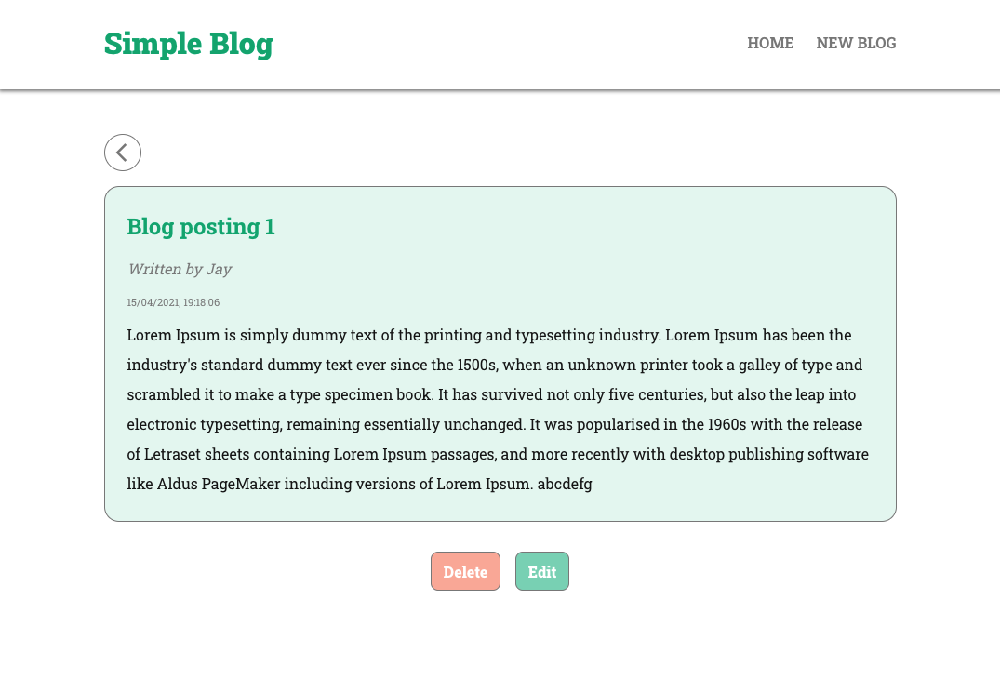

# 7. Project Planner (Vue.js)
## Screenshots

## Features
- Pull and display blog data from JSON server
- Click blog-preview to see more details (e.g. blog body)
- Delete a blog
- Create a blog
- Show loading message (fetching)
- Show error message (fetching)
- 404 page
- Display time created
- Edit blog article

## Skills
- HTML
- CSS
- JS
- React.js
- JSON Server